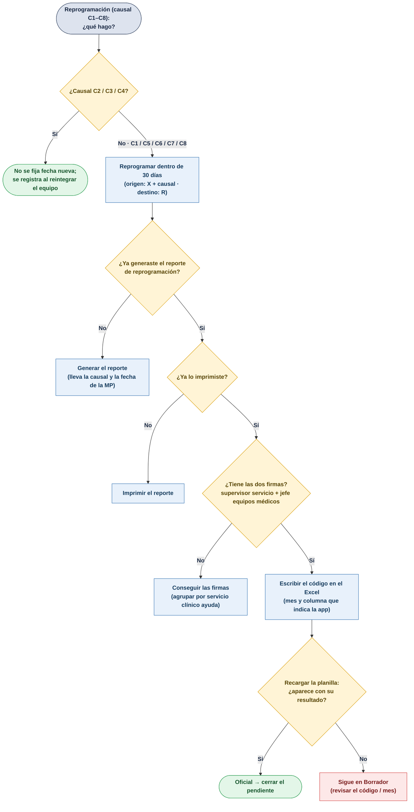

# Árbol de decisión — Ciclo de Reprogramación

Qué hacer con una **reprogramación (causal C1–C8)**: desde la causal hasta oficializar y cerrar.
Imagen: `docs/Arbol_Decision_Reprogramacion.png`.

```mermaid
flowchart TB
  R(["Reprogramación (causal C1–C8):<br/>¿qué hago?"])
  R --> Q0{"¿Causal C2 / C3 / C4?"}
  Q0 -->|Sí| A0(["No se fija fecha nueva;<br/>se registra al reintegrar el equipo"])
  Q0 -->|"No · C1 / C5 / C6 / C7 / C8"| A1["Reprogramar dentro de 30 días<br/>(origen: X + causal · destino: R)"]
  A1 --> Q1{"¿Ya generaste el reporte<br/>de reprogramación?"}
  Q1 -->|No| A2["Generar el reporte<br/>(lleva la causal y la fecha de la MP)"]
  Q1 -->|Sí| Q2{"¿Ya lo imprimiste?"}
  Q2 -->|No| A3["Imprimir el reporte"]
  Q2 -->|Sí| Q3{"¿Tiene las dos firmas?<br/>supervisor servicio + jefe equipos médicos"}
  Q3 -->|No| A4["Conseguir las firmas<br/>(agrupar por servicio clínico ayuda)"]
  Q3 -->|Sí| A5["Escribir el código en el Excel<br/>(mes y columna que indica la app)"]
  A5 --> Q4{"Recargar la planilla:<br/>¿aparece con su resultado?"}
  Q4 -->|Sí| A6(["Oficial → cerrar el pendiente"])
  Q4 -->|No| A7["Sigue en Borrador<br/>(revisar el código / mes)"]

  classDef dec fill:#fff4d6,stroke:#d99a00,color:#5a4500;
  classDef act fill:#e8f1fb,stroke:#2f6fb0,color:#143b5e;
  classDef ok fill:#e3f6e8,stroke:#2e9e54,color:#14552b;
  classDef bad fill:#fde8e8,stroke:#d23c3c,color:#7a1c1c;
  classDef root fill:#dde3ee,stroke:#3a4a66,color:#1b2a44,font-weight:bold;
  class Q0,Q1,Q2,Q3,Q4 dec;
  class A1,A2,A3,A4,A5 act;
  class A0,A6 ok;
  class A7 bad;
  class R root;
```
